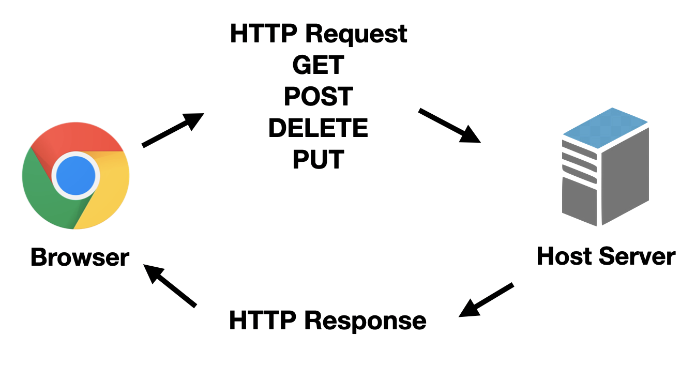
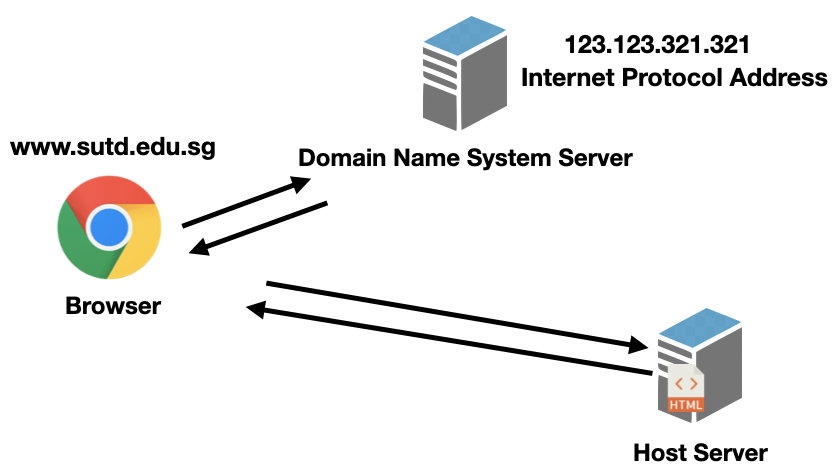

# Intro to web-development with React Workshop
The workshop is a one off workshop that aims to introduce Web Development and the ReactJS framework which will include segments of javascript and CSS flexbox refreshers/lesson.

# Pre-requisite
Basic knowledge on (Be it on python or what not) :
- Dictionary / Objects
- List / Arrays
- Functions
- Loops

# Set-up
- ## NodeJS 
  - https://nodejs.org/en/  (Windows and MacOS alike)
  - For homebrew users (macOS)
    - Brew install node
  - To check if it is installed properly
    - Open your terminal (macOS) or command prompt (windows)
    - Run: npm --version or node --version
    - npm version 6.14.8 or node version 14.12.0 respectively. (Any later version will work fine as well)
- ## Create-React-App
  - I will go through the set up process at the start too but please try downloading it on your own first.
  - Steps are as follows:
    1. Open your terminal (macOS) or command prompt (windows)
    2. cd to your desktop or any folder you prefer by using " cd ./desktop "
       - Run the following command:
        - npx create-react-app 3dc-react-workshop    (This will take awhile)
          - This will create a templated react app under the name of "3dc-react-workshop" in your desktop folder.
- ## Code Editor
  - Any code editor will work fine.
    - Demo will be using visual studio code
    - https://code.visualstudio.com/download

# Lecture Notes
# Table of contents
1. [How the web works](#how-web-works)

## How the Web Works
### Overview of how data is transfered

The web works by sending out Hypertext Transfer Protocol (HTTP) Requests and getting Responses in return.
You can view this as your web browser sending out an envelope as a HTTP request to a server asking for data in return. The server then sends out another envelope with the requested data as a HTTP response.

### Resolving Domain Names

Whenever you type in a website link, it is also called a Domain Name.
A domain name has no information on which server it should get the webpage from.
Therefore, we have a Domain Name System server that caches (temporary stores) which domain name links to which Internet Protocol (IP) Address. An IP Address acts like your house address but for servers.
So in summary, when you type in a domain name, your browser sends out a HTTP Request to a DNS Server to get the IP Address of the server that contains the webpage. With the correct IP Address, your browser then sends another HTTP Request to that server for the webpage.