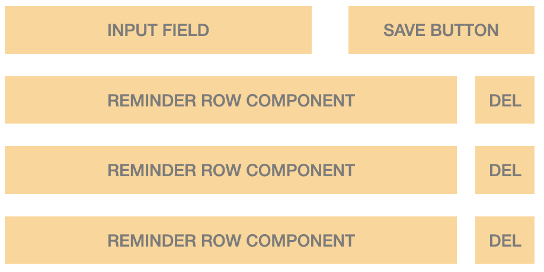
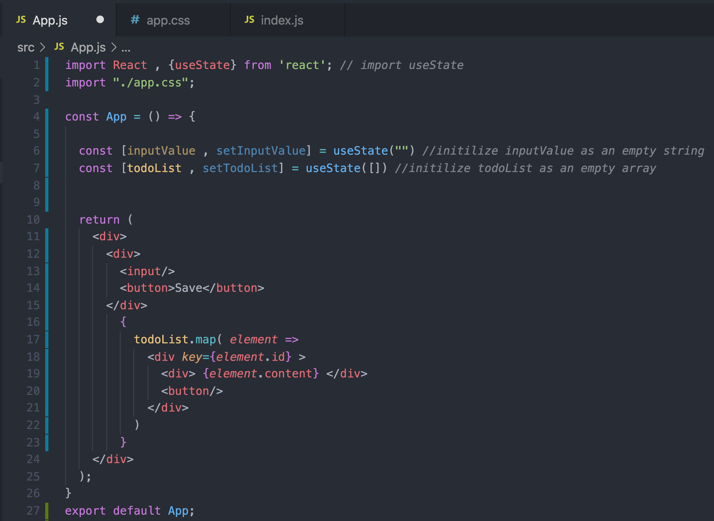
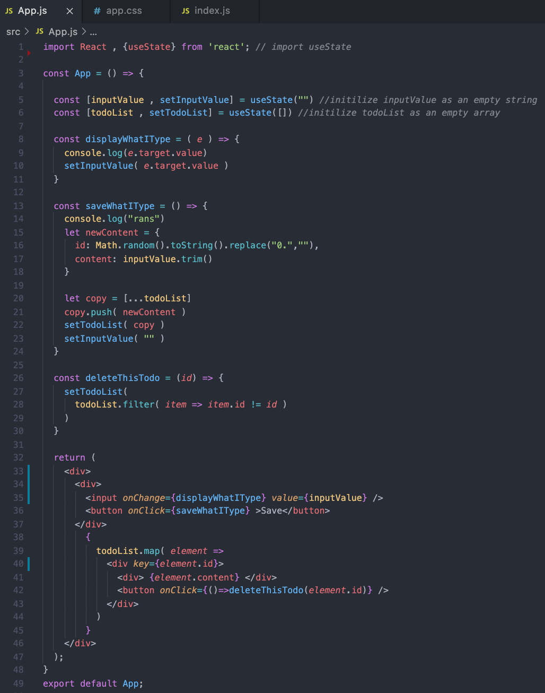
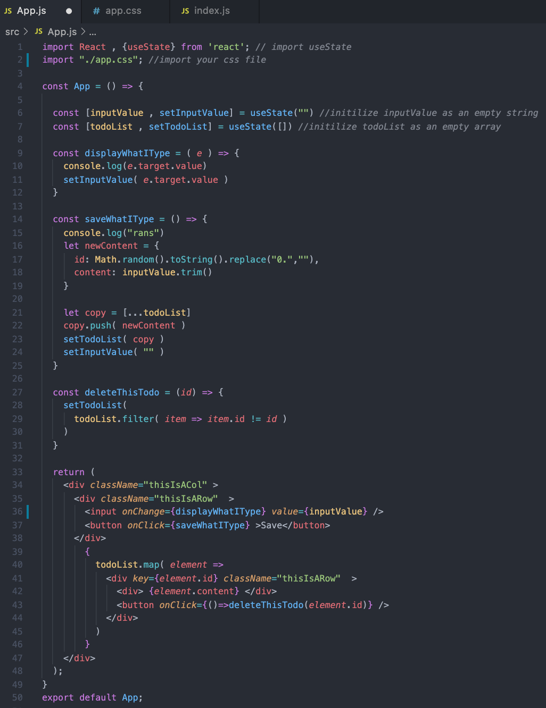

# Intro to web-development with React Workshop
The workshop is a one off workshop that aims to introduce Web Development and the ReactJS framework which will include segments of javascript and CSS flexbox refreshers/lesson.

# Pre-requisite
Basic knowledge on (Be it on python or what not) :
- Dictionary / Objects
- List / Arrays
- Functions
- Loops

# Set-up
- ## NodeJS 
  - https://nodejs.org/en/  (Windows and MacOS alike)
  - For homebrew users (macOS)
    - Brew install node
  - To check if it is installed properly
    - Open your terminal (macOS) or command prompt (windows)
    - Run: npm --version or node --version
    - npm version 6.14.8 or node version 14.12.0 respectively. (Any later version will work fine as well)
- ## Create-React-App
  - I will go through the set up process at the start too but please try downloading it on your own first.
  - Steps are as follows:
    1. Open your terminal (macOS) or command prompt (windows)
    2. cd to your desktop or any folder you prefer by using " cd ./desktop "
       - Run the following command:
        - npx create-react-app 3dc-react-workshop    (This will take awhile)
          - This will create a templated react app under the name of "3dc-react-workshop" in your desktop folder.
- ## Code Editor
  - Any code editor will work fine.
    - Demo will be using visual studio code
    - https://code.visualstudio.com/download

# Lecture Notes
## Table of contents
1. [How the web works](#how-web-works)
    1. [Overview of how data is transfered](#how-web-works/data-transfer)
    2. [Resolving Domain Names](#how-web-works/resolving-domain-names)
    3. [API Endpoint](#how-web-works/api)
2. [Javascript vs Python refresher](#python-vs-javascript)
    1. [Variables](#python-vs-javascript/variables)
    2. [Lists / Arrays](#python-vs-javascript/list-array)
    3. [Object / Dictionary](#python-vs-javascript/object-dic)
    4. [Functions](#python-vs-javascript/functions)
    5. [Loops](#python-vs-javascript/loops)
3. [HTML & CSS](#HTML-CSS)
4. [React](#react)
    1. [Components](#react/compoents)
    2. [State](#react/state)
5. [CSS Flexbox](#flexbox)
    1. [Display flex](#flexbox/display)
    2. [Flex-direction](#flexbox/flexDirection)
    3. [Justify Content](#flexbox/justifyContent)
    4. [Align Content](#flexbox/alignContent)
6. [Breakdown of Demo](#demo)
    1. [Cleaning up create-react-app](#demo/cleanup)
    2. [Breaking down structure of html](#demo/structure)
    3. [Setting up State](#demo/state)
    4. [Event Handlers](#demo/event-handler)
    5. [Setting up CSS](#demo/css)
    6. [Seperating Components](#demo/seperate-component)
6. [Exploration](#explore)

<a name="how-web-works"></a>
## How the Web Works

<a name="how-web-works/data-transfer"></a>
### Overview of how data is transfered

The web works by sending out Hypertext Transfer Protocol (HTTP) Requests and getting Responses in return.
<br/><br/>
You can view this as your web browser sending out an envelope as a HTTP request to a server asking for data in return. The server then sends out another envelope with the requested data as a HTTP response.

<a name="how-web-works/resolving-domain-names"></a>
### Resolving Domain Names

Whenever you type in a website link, it is also called a Domain Name.
A domain name has no information on which server it should get the webpage from.
Therefore, we have a Domain Name System server that caches (temporary stores) which domain name links to which Internet Protocol (IP) Address. An IP Address acts like your house address but for servers.  
<br/><br/>
So in summary, when you type in a domain name, your browser sends out a HTTP Request to a DNS Server to get the IP Address of the server that contains the webpage. With the correct IP Address, your browser then sends another HTTP Request to that server for the webpage.

<a name="how-web-works/api"></a>
### Application Programming Interface (API) Endpoint

After recieving the files needed to load the webpage, the web application frequently also communicates with a database to load dynamic data. In order to do this, the webpage send out HTTP Requests to an Application Programming Interface (API) Endpoint. An API Endpoint acts like a vending machine where you exchange a HTTP Request for data as a HTTP Response.
<br/><br/>
The server whose API endpoint is on, will recieve a HTTP Request and depending on the requests, the server can access a database to find data then return a HTTP response with the requested data back to the server.
<br/><br/>
For example, we load the SUTD webpage and it wants to show an updated number of students currently enrolled. After loading the webpage, in order to keep the number up to date, the web application can send out a HTTP Request to SUTD's server. Once SUTD's server get a HTTP Request, it then communicates with a database to get the lastest number of enrolled students. The server then wraps the data in a HTTP Response and sends it back to the web browser.


<a name="python-vs-javascript"></a>
## Javascript vs Python refresher

<a name="python-vs-javascript/variables"></a>
### Defining Variables
Defining a variable is similiar to how variable works in mathematics.
<br/>
For illustration purposes, we will be assigning the string value "SUTD" to a variable named "school"
```python
# PYTHON
school = "SUTD" #creates a variable named school and assign a string "SUTD" to it
```
```js
// JAVASCRIPT
const school = "SUTD" //creates a constant variable named school
let school = "SUTD" //creates a variable named school and assign a string "SUTD" to it
```
Notice that javascript has 2 ways to define a variable. 
<br/>
`const` creates a constant variable which means the value you assign to it will not change.
<br/>
`let` creates a variable in which its value will be changing down the line.

<a name="python-vs-javascript/list-array"></a>
### Lists / Arrays
Defining a list or array in python vs javascript
<br/>
For illustration purposes, we will be creating an array named thisIsAnArray and assign an empty array to it.
```python
# PYTHON
thisIsAnArray = [] #creates a variable named thisIsAnArray and assigns an empty array to it
```
```js
// JAVASCRIPT
const thisIsAnArray = [] //creates a constant variable named thisIsAnArray and assigns an empty array to it
let thisIsAnArray = [] //creates a variable named thisIsAnArray and assigns an empty array to it
```

<a name="python-vs-javascript/object-dic"></a>
### Object / Dictionary
Defining a list or array in python vs javascript
<br/>
For illustration purposes, we will be creating an object named thisIsAnObject and assign a key value pair.
```python
# PYTHON
thisIsAnArray = {
  key: "value"
} #creates a variable named thisIsAnArray and assigns an object to it.
```
```js
// JAVASCRIPT
const thisIsAnArray = {
  key: "value"
} //creates a constant variable named thisIsAnArray and assigns an object to it.
let thisIsAnArray = {
  key: "value"
} //creates a variable named thisIsAnArray and assigns an object to it.
```

<a name="python-vs-javascript/functions"></a>
### Functions
Defining a function in python vs javascript
<br/>
For illustration purposes, we will be creating an function named thisIsAFunction and make the function take in 1 paramater named paramOne return hello world.
```python
# PYTHON
def thisIsAFunction ( paramOne ):
  return( "hello world" )
```
```js
// JAVASCRIPT : There are 2 types of functions. Function expressions and function declarations.

/*
----Function Expression----
Function is loaded when the line is reached
*/

// The below function is called a Arrow Function (I guess because of the => )
const thisIsAFunction = ( paramOne ) => {
  return( "hello world" )
}
const thisIsAFunction = ( paramOne ) => "hello world"
// Notice how this version of the Arrow Function, doesn't have the curly braces {}
// Without the curly braces, the function automatically return whatever after that. In this case, the function automatically returns "hello world"
const thisIsAFunction = function( paramOne ){
  return("hello world)
}


/* 
----Function Declaration----
Function Declaration are hoisted to the top of the code.
Meaning the funtion is loaded before anything else
*/

function thisIsAFunction( paramOne ){
  return( "hello world" )
}
```
```js
// To demostrate the differences
// Take note that console.log acts just like python print function.
console.log( helloWorldFunction() )  // This will have an error
const helloWorldFunction = () => "hello world"

console.log( helloWorldFunction() )  // This will work
function helloWorldFunction( ){
  return( "hello world" )
}
```

<a name="python-vs-javascript/loops"></a>
### Loops
Creating a loop to reiterate over an array in python vs javascript
<br/>
For illustration purposes, we will reiterate over an array named oneToTen which contains digits 1 to 10.
```python
oneToTen = [ 1,2,3,4,5,6,7,8,9,10 ]

for eachElement in oneToTen:
  print(eachElement)
# prints 1 2 3 4 ...
```
```js
const oneToTen = [ 1,2,3,4,5,6,7,8,9,10 ]

oneToTen.forEach( eachElement => console.log(eachElement) )
// prints 1 2 3 4 ...

// Another method to reiterate over an array is
oneToTen.map( (eachElement, eachIndex)=> console.log(eachElement, eachIndex) )
// .map gives access to each element's index
```

<a name="HTML-CSS"></a>
## Hyper Text Markup Language & Cascading Style Sheets
Hyper Text Markup Language (HTML), thelanguage of the document that the browser reads for content to display.
<br/>
Cascading Style Sheets (CSS), the language used by the browser to decide the visual look of the content.
<br/><br/>
HTML and CSS work hand in hand to display and beautify a webpage respectively.

### HTML
HTML can be thought of as containers. HTML start and end off with tags enclosed in arrow brackets.
<br/>

<br/>
For example, we want to replicate the image above, we would then split each individual component into a container.
<br/>
In HTML code, it will look like
```html
  <div>
    <input/>
    <button> Save <button/>
    <div> list 1 </div>
    <div> list 2 </div>
    <div> list 3 </div>
  </div>
```
Take note that each html tag has an opening and a closing tag. Eg
```html
<div></div>
```
A self closing tag can also be used. Eg
```html
<input/>
```
Each tag has its own attributes too. Eg
```html
<button onClick="whenButtonClickRunThisFunction()" />.
``` 
This button has an event handler function name "whenButtonClickRunThisFunction" that runs everytime the button is clicked.

### CSS
CSS can be thought of as a bunch of properties you want each HTML container to have.
```html
  <div class="redBoxClass" >
    This is a Red Box
  </div>
```
First we assign a class to the HTML tag.
```css
.redBoxClass{
  background-color: red
}
```
CSS then assigns a property to the following class.

<a name="react"></a>
## React
<a name="react/components"></a>
### Components
The react library are made out of components. Just like how HTML is made up of multiple containters, react uses the same container concept but calls it components insetad.

<br/>
A React Component is a Javascript Function that takes in an object called `props` and return `JSX`.
<br/>
You can view props as properties being pass into a component, just like how you pass parameters into a function.
<br/>
You can view JSX as HTML but used as an extension of Javascript.
<br/>
An example of a component
<br/>
```js
// We first create a function that takes in props as a parameter and return JSX.
const thisIsAComponent = ( props ) => {
  return(
    <div> 
      This is like HTML but it is actually JSX.
    </div>
  )
}
// If we want to write javascript when we are in JSX, we need to write it in curly braces
const thisIsAComponent = ( props ) => {
  return(
    <div> 
      This is like HTML but it is actually JSX.
      { 
        console.log(" If you want to add Javascript code in JSX, you need to wrap it in curly braces {} ")
      }
    </div>
  )
}
```

<a name="react/state"></a>
### State
A state is like a temporary storage on your browser. It can be viewed like a temporary database.
<br>/<br/>
React uses a function called `useState` to intialize a state. `useState` is one of the many functions called react hooks.
<br/>
useState function takes in the initial state of the state. It returns an array containing the current state and a function to update the state.
For example, we want inialize a state that initially have a value of `"Hello World".`
```js
const [ currentValueOfState , functionToUpdateState ] = useState( "Hello World" )
// As shown, passing "Hello World" to useState assigns "Hello World" to currentValueOfState.
// In which to update currentValueOfState, we need to use functionToUpdateState.
```
To illustrate what is happening
```js
const [ currentValueOfState , functionToUpdateState ] = useState( "Hello World" )

console.log( currentValueOfState ) // this will print "Hello World"

functionToUpdateState("SUTD")

console.log( currentValueOfState ) // this will print "SUTD"
```


<a name="flexbox"></a>
## CSS Flexbox
CSS Flexbox are useful bunch of CSS properties that allow webpages to be responsive. Meaning, if the browser changes width or height, the content will adapt accordingly. Flexbox works with the concepts of rows and columns.
<br/>
[Link to css flexbox documentation. It contains a detailed writeup on flexbox.](https://www.css-tricks.com/snippets/css/a-guide-to-flexbox/)
<br/><br/>

<a name="flexbox/display"></a>
### Display Flex
To enable flexbox properties, we first need to enable flex container.
<br/>
To do this, we need the to use `display: flex`.
```html
<div class="flex" >This will become a flex container</div>
```
```css
.flex{
  display: flex
}
```

<a name="flexbox/flexDirection"></a>
### Flex-direction
Flex-direction determines if your flex container should arrange the content inside as a row or column.
<br/>
For example
```html
<div class="flex" >
  <div> content 1 </div>
  <div> content 2 </div>
  <div> content 3 </div>
</div>
```
```css
.flex{
  display: flex;
  flex-direction: row;
}
```


<a name="flexbox/justifyContent"></a>
### Justify Content
Justify content determines how content should be spaced out in the main axis.
<br/>
When I use `flex-direction: row` , my main axis is the row axis or the X axis.
<br/>
When I use `flex-direction: column` , my main axis is the column axis or the Y axis.
<br/>
There are a few properties that can be used like `space-around` , `flex-start`. Do check out the documentation, it is very well written.
<br/>
[Link flexbox Documentation](https://www.css-tricks.com/snippets/css/a-guide-to-flexbox/)
<br/>
For example
```html
<div class="flex" >
  <div> content 1 </div>
  <div> content 2 </div>
  <div> content 3 </div>
</div>
```
```css
.flex{
  display: flex;
  flex-direction: row;
  justify-content: space-around;
}
```

<a name="flexbox/alignContent"></a>
### Align Content
Align content acts similiar to justify-content, just that the axis is the opposite.
<br/>
When I use `flex-direction: row` , my main axis is the row axis or the X axis. Therefore, `align-content` adjusts the column axis or Y axis.
<br/>
When I use `flex-direction: column` , my main axis is the column axis or the Y axis. Therefore, `align-content` adjusts the row axis or X axis.
<br/>
There are a few properties that can be used like `space-around` , `flex-start`. Do check out the documentation, it is very well written.
<br/>
[Link flexbox Documentation](https://www.css-tricks.com/snippets/css/a-guide-to-flexbox/)
<br/>
For example
```html
<div class="flex" >
  <div> content 1 </div>
  <div> content 2 </div>
  <div> content 3 </div>
</div>
```
```css
.flex{
  display: flex;
  flex-direction: row;
  justify-content: space-around;
  align-content: center;
}
```

<a name="demo"></a>
## Demo

<a name="demo/cleanup"></a>
## Cleaning up create react app
First we need to use the create-react-app package to initialize a templated app for us. To do this, open your terminal (mac) or command prompt (windows).
<br/>
Change directory to the folder you want to place the application folder in. In this case, let's use the desktop folder.
<br/>
To change directory to the desktop folder, run `cd ./desktop`.
<br/>
Let's install the create react app template. Run the following commands `npx create-react-app todo-app-demo`
<br/>
This will create a folder named todo-app-demo in your desktop folder.

<br/><br/>
Let's start by cleaning up some files to get started from scratch.
<br/>
Delete the following files in the todo-app-demo.
<br/>

<br/>
Delete the following files:
<br/>
  - App.css
  - App.test.js
  - index.css
  - logo.svg
<br/>

<br/>
You should be left with these files.
<br/><br/>
Next, we shall clean up the files.
<br/>
Opening the file App.js, delete the following lines to change as per the image.


<br/>
Opening the file index.js, delete the following lines to change as per the image.


<br/><br/>
Lets run the application. Go back to your terminal and change directory into the todo-app-demo by running 
<br/>
`cd ./todo-app-demo`
<br/>
To run the application, run `npm run start`.
<br/>
Your browser should open and look like this.
<br/>

<br/>


<a name="demo/structure"></a>
## Breaking down structure of html
Let's first see how we can picture how the app will look like then break it down into html/jsx code.
<br/>

<br/>
The image shows how the app will look like. We have 3 main big containers. 
<br/>
1 container to contain the entire app.
<br/>
1 inner container that should behave like a row for the input and save componenets.
<br/>
1 inner container that should behave like a column for the rows of reminder row components.
<br/>
In HTML code
<br/>

```html
<div>
  <div> For the input and save button </div>
  <div> For the rows of reminder components </div>
</div>
```
<br/>
In React
<br/>

```js
const myComponent = (props) => {
  return(
    <div>
      <div> For the input and save button </div>
      <div> For the rows of reminder components </div>
    </div>
  )
}
```
<br/>
We then can further break down into the individual input and save button. Followed by the reminder and delete button.
<br/>
In HTML code
<br/>

```html
<div>
  <div> 
    <input/>
    <button>Save</button>
  </div>
  <div> 
    <div> Reminder content </div>
    <button/>
  </div>
</div>
```
<br/>
In React
<br/>

```js
const myComponent = (props) => {
  return(
    <div>
      <div> 
        <input/>
        <button>Save</button>
      </div>
      <div> 
        <div> Reminder content </div>
        <button/>
      </div>
    </div>
  )
}
```
<br/>
To add this into our app, let's open the app.js file and add in the react code.
<br/>


<a name="demo/state"></a>
## Setting up State
Let's breakdown how we should set up the state.
<br/>
We need to store 2 things.
<br/>
We need store the characters in which our user will type and then store those characters into a list or array.
<br/>
Therefore, we should intialise our state like
<br/>

```js
const [inputValue , setInputValue] = useState("") //initilize inputValue as an empty string
const [todoList , setTodoList] = useState([]) //initilize todoList as an empty array
```
<br/>
So whenever, we type something, it gets stored into inputValue and then when we save, it gets stored into todoList.
<br/>
Now for the Reminder content, we do not want to keep manually adding divs as the todoList increases, we can use a loop to assit us.
<br/>

```js
const myComponent = (props) => {
  return(
    <div>
      <div> 
        <input/>
        <button>Save</button>
      </div>
      <div> 
        {
          todoList.map( element =>
            <div>
              <div> {element.content} </div>
              <button/>
            </div>
          )
        }
      </div>
    </div>
  )
}
```
<br/><br/>
Putting everything into our app.js code as such
<br/>

<br/>

<a name="demo/event-handler)"></a>
## Event Handlers
Now that we have the state and base structure of our React App. We need javascript functions to interact with our state.
<br/>
Let's breakdown what kind of functions we need
<br/><br/>
We need 1 function to take the characters our user type and update the `inputValue` value.
<br/><br/>
Whenever our user click save, we need 1 functon to then save the `inputValue` characters into our  `todoList` array. Don't forget we also need to empty out `inputValue` characters so that the user can start typing on a clean input box again. Another thing to take note is that when storing the texts, we need a unique identifier so that we know which task to delete even if the 2 tasks have the same text content. For the purposes of this demo, we will use javascript's build in random function `math.random.toString().replace(“0.”,””)`. However do not use this in production, please use a proper uuid library like [uuid](https://www.npmjs.com/package/uuid).
<br/><br/>
So our `todoList` state will store text like this
<br/><br/>
```js
todoList = [
  {
    id: "RANDOM STRING TO INDENTIFY THE TASK",
    content: "WHATEVER THE USER TYPED AND SAVED"
  }
]
```
<br/><br/>
Next, we need a function to then delete the correct todo task and then update `todoList` with the updated todo list.
<br/><br/>
Lets code our the functions
<br/>

```js
  const displayWhatIType = ( e ) => {
    // Notice how this takes in a e parameter.
    // It is actually the event object which your browser automatically passes into the function.
    setInputValue( e.target.value )
  }
  
  const saveWhatIType = () => {
    // Create an object that represents what the new todo task entry will look like
    let newContent = {
      id: math.random().toString().replace("0.",""),
      content: inputValue.trim()
    }
  
    /* 
    Make a copy of the current value of todoList. This is because if we do not append/push directly into the current value of todoList. This will prevent unpredicted bugs. To make a copy, we use the spread operator ...
    */
    let copy = [...todoList]
  
    // Add the new content into the copy
    copy.push( newContent )
  
    // update state
    setTodoList( copy )
    setInputValue( "" )
  
    // You can combine all the code into one line like this
    setTodoList( [...todoList, {
          id: math.random.toString().replace("0.",""),
          content: inputValue.trim()
        }
      ] )
    setInputValue( "" )
  }
  
  const deleteThisTodo = (id) => {
    setTodoList(
      todoList.filter( item => item.id != id )
    )
  }
``` 
<br/>
Going back to our react app, we need to add these event handlers into our app.js file. We also need to add the onClick and onChange attributes to to the buttons and input components.
<br/><br/>
After adding the function to your app.js, it should look like
<br/>

<br/>
I would like to bring the focus now to the event handlers on the JSX code
<br/>

```html
<div>
  <div> 
    <input onChange={displayWhatIType} value={inputValue} /> <!--When input is changing (user typing), run displayWhatIType function -->
                                                  <!--input then displays whatever is in the value attribute (in this case,inputValue) -->
    <button onClick={saveWhatIType} >Save</button> <!-- On click on save button, run saveWhatIType function -->
  </div>
  <div> 
    {
      todoList.forEach( element =>
        <div>
          <div> {element.content} </div>
          <button onClick={()=>deleteThisTodo(element.id)} />
          <!-- 
            On click on delete button, run deleteThisTodo function.
            However, remember we need to get the unique id of the todo task. 
            To do this we need to pass the parameter element.id
            But we can't type it out as onClick={deleteThisTodo(element.id)}
            This will cause the deleteThisTodo function to be invoked/run when the page loads.
            So to avoid that, we use an arrow function to create a new function that when run, runs the deleteThisTodo function.
          -->
        </div>
      )
    }
</div>
    </div>
```

<a name="demo/css)"></a>
## Setting up CSS
We first need give class names to our JSX elements.
<br/>

```js
  return (
    <div className="thisIsACol">
      <div className="thisIsARow" > 
        <input onChange={displayWhatIType} value={inputValue} />
        <button onClick={saveWhatIType} >Save</button>
      </div>
      <div className="thisIsACol"> 
        {
          todoList.forEach( (element) =>
            <div className="thisIsARow">
              <div> {element.content} </div>
              <button onClick={()=>deleteThisTodo(element.id)} />
            </div>
          )
        }
      </div>
    </div>
  );
```
<br/>
Now your file looks like this
<br/>

<br/><br/>
Notice how we split up the containers that should act as a row or column. This means we can code 1 css class with that particular property and apply it anywhere else. This is a design prinipal you should try to apply as often as possible.

<br/><br/>
Let's create a new css file named `app.css`
<br/>

<br/>
Let's add the css properties like this
<br/>

```css
.thisIsARow{
    display: flex;  /* enable flex */ 
    flex-direction: row; /* act as a row */ 
    justify-content: space-around; /* in the main axis (x axis), evenly space my content */ 
    align-content: center; /* in the other axis (y axis), center my content */ 
}
.thisIsACol{
    display: flex; /* enable flex */ 
    flex-direction: row; /* act as a row */ 
    justify-content: space-around; /* in the main axis (y axis), evenly space my content */ 
    align-content: center; /* in the other axis (x axis), center my content */
}
```
